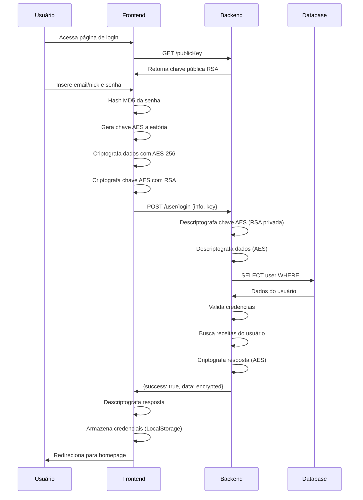
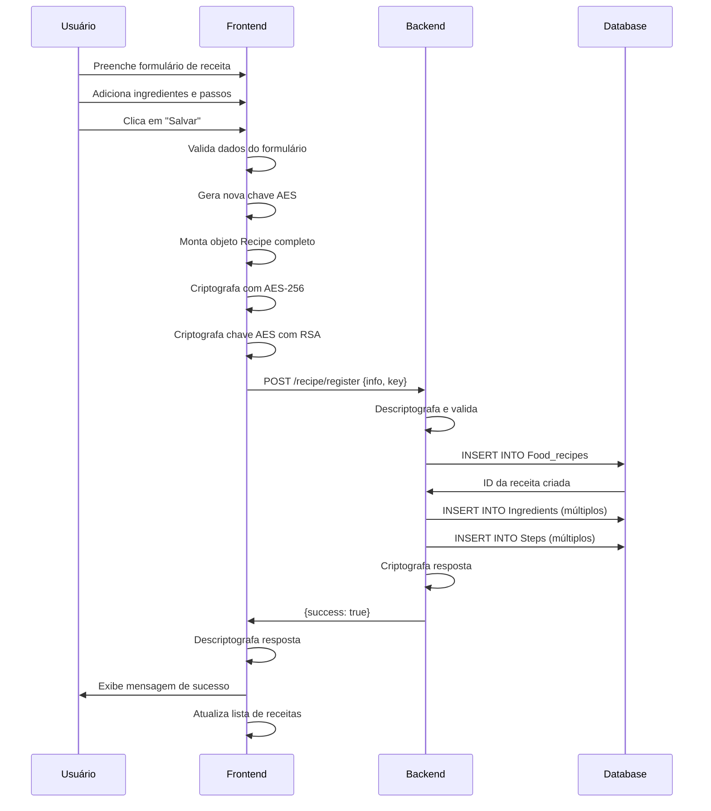
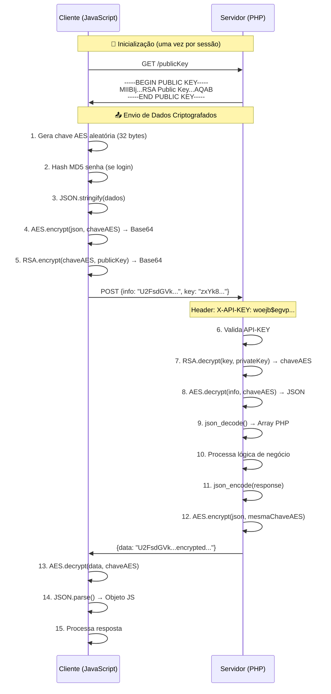

<div align="center">

# 🍳 Miam

### _Where Culinary Art Meets Cryptographic Security_

[](https://www.php.net/)
[](https://developer.mozilla.org/en-US/docs/Web/JavaScript)
[](https://www.mysql.com/)
[](/)
[](/)

_Uma aplicação web completa de gerenciamento de receitas culinárias com criptografia híbrida_

[✨ Features](#-features) •
[🏗️ Arquitetura](#%EF%B8%8F-arquitetura) •
[🚀 Começando](#-começando) •
[🔐 Segurança](#-segurança) •
[📚 Documentação](#-estrutura-do-projeto)

---

</div>

## 🎯 Sobre o Projeto

**Miam** é uma aplicação web completa de gerenciamento de receitas culinárias que implementa segurança de dados em nível empresarial. Desenvolvido como projeto acadêmico para a disciplina de Programação Web da PUC, o sistema combina uma interface intuitiva e responsiva com uma arquitetura robusta baseada em **criptografia híbrida** (AES-256 + RSA-2048).

O projeto demonstra a implementação prática de conceitos avançados de segurança web, arquitetura de software em camadas, e boas práticas de desenvolvimento full-stack.

### 💡 Por que Miam?

- 🔒 **Segurança em Primeiro Lugar**: Todos os dados sensíveis são criptografados no cliente antes de serem transmitidos
- 🎨 **Clean Architecture**: Arquitetura em camadas (Controller, Service, Repository) seguindo os princípios SOLID
- 🛡️ **Proteção contra Ataques**: SQL Injection, XSS e Man-in-the-Middle prevenidos por design
- 📦 **Modular e Escalável**: Código organizado, documentado e fácil de manter
- 🎯 **API RESTful**: Endpoints bem definidos com sistema de roteamento personalizado
- 💾 **Persistência Segura**: MySQL com prepared statements e queries parametrizadas

---

## ✨ Features Implementadas

### 👥 Sistema Completo de Gerenciamento de Usuários

- ✅ **Registro de Usuário**: Validação completa de dados (nome, nickname, email, data de nascimento, senha)
- 🔑 **Sistema de Login**: Autenticação segura com senha hash MD5 e criptografia AES
- 👤 **Perfil do Usuário**: Recuperação e exibição de dados do usuário autenticado
- ✏️ **Edição de Perfil**: Atualização de informações pessoais com validação
- 🗑️ **Exclusão de Conta**: Remoção completa do usuário e suas receitas
- 💾 **Persistência de Sessão**: LocalStorage para manter usuário logado

### 📖 Sistema Completo de Gerenciamento de Receitas

- 📝 **Cadastro de Receitas**: Criação completa com nome, categoria, porções, avaliação e imagem
- 🥘 **Sistema de Ingredientes**: Adicionar múltiplos ingredientes com nome, quantidade e tipo de medida
- 📋 **Passos de Preparo**: Descrição ordenada e numerada de cada etapa
- ⭐ **Sistema de Favoritos**: Marcar/desmarcar receitas favoritas
- 🌟 **Sistema de Avaliação**: Rating de 1 a 5 estrelas para cada receita
- 🖼️ **Suporte a Imagens**: Upload e armazenamento de fotos das receitas
- ✏️ **Edição Completa**: Modificar todos os dados de uma receita existente
- 🗑️ **Exclusão de Receitas**: Remoção com confirmação
- 🔍 **Visualização Detalhada**: Interface dedicada para ver todos os detalhes de uma receita

### 🔐 Segurança de Nível Empresarial

- 🔑 **Criptografia Híbrida Completa**:
  - **Cliente**: CryptoJS (AES-256-CBC) + JSEncrypt (RSA-2048)
  - **Servidor**: OpenSSL (PHP) para descriptografia
- 🔒 **Chave Simétrica Única**: Geração de chave aleatória para cada requisição
- 🛡️ **API Key Global**: Autenticação de todas as requisições HTTP
- 💾 **Prepared Statements**: 100% das queries SQL parametrizadas
- 🔐 **Par de Chaves RSA**: Chaves pública/privada de 2048 bits
- 🔏 **Hash de Senhas**: MD5 no cliente antes de criptografar
- 🌐 **Endpoint de Chave Pública**: `/publicKey` para recuperação segura

---

## 🏗️ Arquitetura

### Stack Tecnológico

<table>
<tr>
<td width="50%" valign="top">

#### 🎨 Frontend

```
📦 Tecnologias
 ├─ HTML5 & CSS3
 ├─ JavaScript ES6+
 ├─ CryptoJS (AES-256)
 └─ JSEncrypt (RSA-2048)

🎯 Padrões
 ├─ MVC Pattern
 ├─ Modular Architecture
 └─ Async/Await
```

</td>
<td width="50%" valign="top">

#### ⚙️ Backend

```
📦 Tecnologias
 ├─ PHP 8.4+
 ├─ MySQL 8.0+
 ├─ Composer (phpdotenv)
 ├─ OpenSSL (RSA/AES)
 └─ Apache Server

🎯 Padrões
 ├─ Repository Pattern
 ├─ Service Layer
 ├─ Router Pattern
 └─ Dependency Injection
```

</td>
</tr>
</table>

### 💻 Tecnologias Detalhadas

#### Backend (PHP)

- **PHP 8.4+**: Linguagem server-side com tipagem forte
- **MySQL 8.0+**: Banco de dados relacional
- **Composer**: Gerenciador de dependências PHP
- **phpdotenv**: Gerenciamento de variáveis de ambiente
- **OpenSSL**: Biblioteca de criptografia
- **Apache XAMPP**: Servidor web local

#### Frontend (JavaScript)

- **JavaScript ES6+**: Linguagem client-side moderna
- **CryptoJS**: Biblioteca para criptografia AES-256-CBC
- **JSEncrypt**: Biblioteca para criptografia RSA-2048
- **HTML5 & CSS3**: Marcação e estilização
- **LocalStorage API**: Persistência de dados no navegador
- **Fetch API**: Requisições HTTP assíncronas

#### Bibliotecas de Criptografia

- **CryptoJS 4.x**:
  - AES-256-CBC para criptografia simétrica
  - MD5 para hash de senhas
  - Geração de chaves aleatórias
- **JSEncrypt**:
  - RSA-2048 para criptografia assimétrica
  - Criptografia de chaves AES com chave pública
- **OpenSSL (PHP)**:
  - Descriptografia RSA com chave privada
  - Descriptografia AES no servidor
  - Geração de pares de chaves RSA

### 🔄 Fluxo Completo da Aplicação

#### 1️⃣ Autenticação do Usuário



#### 2️⃣ Cadastro de Receita



#### 3️⃣ Fluxo de Criptografia Detalhado



---

## 📚 Estrutura do Projeto

```
Miam/
│
├── 📁 backend/                          # Servidor PHP (API RESTful)
│   ├── 🔌 connection/                  # Camada de conexão com banco de dados
│   │   └── getCon.php                  # Singleton de conexão MySQL
│   │
│   ├── 🎮 controller/                  # Camada de Controllers
│   │   ├── Router.php                  # Sistema de rotas RESTful personalizado
│   │   ├── userController.php         # Endpoints: login, register, edit, delete, return
│   │   └── recipeController.php       # Endpoints: register, edit, delete
│   │
│   ├── 🔐 encryption/                  # Sistema de criptografia híbrida
│   │   └── encryption.php              # Funções AES-256-CBC & RSA-2048
│   │                                   # - decryptDataSymmetric()
│   │                                   # - encryptDataSymmetric()
│   │                                   # - decryptDataAssymetric()
│   │                                   # - encryptResponse()
│   │
│   ├── 📦 model/                       # Modelos de domínio (Entities)
│   │   ├── User.php                    # Entidade usuário (JsonSerializable)
│   │   ├── Recipe.php                  # Entidade receita com ingredients/steps
│   │   ├── Ingredient.php              # Entidade ingrediente
│   │   └── Step.php                    # Entidade passo de preparo
│   │
│   ├── 💾 repository/                  # Camada de persistência (Data Access)
│   │   ├── userRepository.php          # CRUD usuários + queries específicas
│   │   ├── recipesRepository.php       # CRUD receitas (findById, findAll, etc)
│   │   ├── ingredientRepository.php    # Operações com ingredientes
│   │   └── stepRepository.php          # Operações com passos
│   │
│   ├── 🔧 service/                     # Camada de lógica de negócio
│   │   ├── userService.php             # loginUser, registerUser, editUser, etc
│   │   └── recipesService.php          # registerRecipe, editRecipe, deleteRecipe
│   │
│   ├── 📦 vendor/                      # Dependências do Composer
│   │   ├── vlucas/phpdotenv/          # Gerenciamento de variáveis de ambiente
│   │   └── ...                         # Outras dependências
│   │
│   ├── 🔑 private_key.pem              # Chave privada RSA-2048
│   ├── 🔓 public_key.pem               # Chave pública RSA-2048
│   ├── 📋 composer.json                # Dependências PHP (phpdotenv)
│   ├── 🔒 .env                         # Variáveis de ambiente (DB credentials)
│   └── 🚪 index.php                    # Entry point da API + definição de rotas
│
├── 📁 frontend/                         # Cliente Web (SPA)
│   └── 🖥️ Desktop/                     # Interface Desktop
│       ├── 📦 models/                  # Modelos JavaScript (Classes ES6+)
│       │   ├── User.js                 # Classe User
│       │   ├── Recipe.js               # Classe Recipe
│       │   ├── Ingredient.js           # Classe Ingredient
│       │   └── Step.js                 # Classe Step
│       │
│       ├── 🎨 pages/                   # Páginas da aplicação
│       │   ├── index.html              # Página inicial (redireciona para login)
│       │   │
│       │   ├── homepage/               # Dashboard do usuário
│       │   │   ├── index.html          # Interface principal
│       │   │   ├── css/index.css       # Estilos da homepage
│       │   │   ├── js/index.js         # Lógica da homepage
│       │   │   └── imagens/            # Assets visuais
│       │   │
│       │   ├── login/                  # Autenticação
│       │   │   ├── index.html          # Interface de login/registro
│       │   │   ├── css/index.css       # Estilos de autenticação
│       │   │   ├── js/
│       │   │   │   ├── index.js        # Lógica geral
│       │   │   │   ├── login.js        # Lógica de login
│       │   │   │   └── register.js     # Lógica de registro
│       │   │   └── imagens/            # Assets visuais
│       │   │
│       │   └── recipepage/             # Página de receita
│       │       ├── index.html          # Interface da receita
│       │       ├── css/index.css       # Estilos da receita
│       │       ├── js/index.js         # Lógica de CRUD receitas (914 linhas)
│       │       └── images/             # Assets visuais
│       │
│       └── 🛠️ utils/                   # Utilitários
│           └── regex.js                # Validações e expressões regulares
│
├── ⚙️ config.js                         # Configurações globais (API_KEY)
├── 📄 LICENSE                           # Licença MIT
└── 📖 README.md                         # Documentação completa

```

### 🎯 API Endpoints Implementados

#### 👥 Usuários (`/user/*`)

| Método   | Endpoint         | Descrição                       |
| -------- | ---------------- | ------------------------------- |
| `POST`   | `/user/register` | Cadastro de novo usuário        |
| `POST`   | `/user/login`    | Autenticação de usuário         |
| `GET`    | `/user/return`   | Retorna dados do usuário        |
| `PUT`    | `/user/edit`     | Atualiza informações do usuário |
| `DELETE` | `/user/delete`   | Remove conta do usuário         |

#### 🍽️ Receitas (`/recipe/*`)

| Método   | Endpoint           | Descrição                      |
| -------- | ------------------ | ------------------------------ |
| `POST`   | `/recipe/register` | Cadastra nova receita completa |
| `PUT`    | `/recipe/edit`     | Atualiza receita existente     |
| `DELETE` | `/recipe/delete`   | Remove receita por ID          |

#### 🔐 Segurança

| Método | Endpoint     | Descrição                 |
| ------ | ------------ | ------------------------- |
| `GET`  | `/publicKey` | Retorna chave pública RSA |

> **Nota**: Todos os endpoints (exceto `/publicKey`) requerem:
>
> - Header: `X-API-KEY`
> - Dados criptografados com AES-256
> - Chave AES criptografada com RSA-2048

---

## 🚀 Começando

### 🗄️ Configuração do Banco de Dados

Execute o seguinte script SQL para criar o banco de dados e todas as tabelas necessárias:

```sql
-- Criação do banco de dados
CREATE DATABASE IF NOT EXISTS TDE_Prog_web;
USE TDE_Prog_web;

-- Tabela de Usuários
CREATE TABLE Users (
    ID_user INT PRIMARY KEY AUTO_INCREMENT,
    name VARCHAR(100) NOT NULL,
    nickname VARCHAR(100) NOT NULL UNIQUE,
    email VARCHAR(100) NOT NULL UNIQUE,
    birth_date DATE NOT NULL,
    password VARCHAR(255) NOT NULL
);

-- Tabela de Receitas
CREATE TABLE Food_recipes (
    ID_Food_recipe INT PRIMARY KEY AUTO_INCREMENT,
    ID_user INT NOT NULL,
    Recipe_name VARCHAR(45) NOT NULL,
    Category ENUM('main course', 'dessert', 'appetizer/snack', 'soup', 'salad', 'drink', 'pasta') NOT NULL,
    Portions INT NOT NULL,
    Rating DECIMAL(2,1) NOT NULL,
    Favorite BOOL NOT NULL DEFAULT FALSE,
    Food_image BLOB,
    FOREIGN KEY(ID_user) REFERENCES Users(ID_user)
        ON DELETE CASCADE,
    CONSTRAINT check_rating CHECK(Rating BETWEEN 0 AND 5)
);

-- Tabela de Passos das Receitas
CREATE TABLE Steps (
    ID_Food_recipe INT NOT NULL,
    Num_step INT NOT NULL,
    Description TEXT NOT NULL,
    PRIMARY KEY (ID_Food_recipe, Num_step),
    FOREIGN KEY (ID_Food_recipe) REFERENCES Food_recipes(ID_Food_recipe)
        ON DELETE CASCADE
);

-- Tabela de Ingredientes
CREATE TABLE ingredients (
    ID_Food_recipe INT NOT NULL,
    Ingredient_name VARCHAR(45) NOT NULL,
    Quantity DECIMAL(10,2) NOT NULL,
    Type_quantity ENUM("tablespoon", "teaspoon", "cups", "ml", "l", "g", "kg", "unit") NOT NULL,
    Avaible BOOL NOT NULL DEFAULT FALSE,
    PRIMARY KEY (ID_Food_recipe, Ingredient_name),
    FOREIGN KEY(ID_Food_recipe) REFERENCES Food_recipes(ID_Food_recipe)
        ON DELETE CASCADE
);
```

### 📊 Modelo de Dados

O banco de dados segue um modelo relacional bem estruturado com integridade referencial:

<table>
<tr>
<td width="50%">

**👤 Users**

- `ID_user` (PK, AUTO_INCREMENT)
- `name` (VARCHAR 100)
- `nickname` (VARCHAR 100, UNIQUE)
- `email` (VARCHAR 100, UNIQUE)
- `birth_date` (DATE)
- `password` (VARCHAR 255, HASHED)

</td>
<td width="50%">

**🍽️ Food_recipes**

- `ID_Food_recipe` (PK, AUTO_INCREMENT)
- `ID_user` (FK → Users)
- `Recipe_name` (VARCHAR 45)
- `Category` (ENUM: 7 categorias)
- `Portions` (INT)
- `Rating` (DECIMAL 2,1: 0-5)
- `Favorite` (BOOL, default: FALSE)
- `Food_image` (BLOB)

</td>
</tr>
<tr>
<td>

**📝 Steps**

- `ID_Food_recipe` (FK → Food_recipes, PK)
- `Num_step` (INT, PK)
- `Description` (TEXT)

**Relacionamento**: 1:N (uma receita tem N passos)

</td>
<td>

**🥘 Ingredients**

- `ID_Food_recipe` (FK → Food_recipes, PK)
- `Ingredient_name` (VARCHAR 45, PK)
- `Quantity` (DECIMAL 10,2)
- `Type_quantity` (ENUM: 8 unidades)
- `Avaible` (BOOL, default: FALSE)

**Relacionamento**: 1:N (uma receita tem N ingredientes)

</td>
</tr>
</table>

**Categorias de Receitas**: `main course`, `dessert`, `appetizer/snack`, `soup`, `salad`, `drink`, `pasta`

**Unidades de Medida**: `tablespoon`, `teaspoon`, `cups`, `ml`, `l`, `g`, `kg`, `unit`

**Constraints**:

- `ON DELETE CASCADE`: Exclusão de usuário remove todas suas receitas
- `CHECK CONSTRAINT`: Rating entre 0 e 5
- `UNIQUE`: Email e nickname únicos por usuário

### 📋 Estrutura das Classes

#### Backend (PHP)

```php
// User.php - Modelo de domínio
class User implements JsonSerializable {
    private int $idUser;
    private string $name;
    private string $nickname;
    private string $email;
    private DateTime $birthDate;
    private string $password;
    private array $recipes;

    // Construtor, getters, setters e jsonSerialize()
    public static function constructFromArray(array $data, bool $mysql = false): User
}

// Recipe.php - Modelo de domínio completo
class Recipe implements JsonSerializable {
    private int $idRecipe;
    private string $name;
    private string $category;
    private int $portions;
    private float $rating;
    private bool $favorite;
    private ?string $image;
    private array $steps;        // Array de Step
    private array $ingredients;  // Array de Ingredient

    public static function constructFromArray(array $data, bool $mysql = false): Recipe
}

// GetCon.php - Singleton de conexão
class GetCon {
    private static ?GetCon $instance = null;
    private mysqli $con;

    private function __construct()  // Private para Singleton
    public static function getInstance(): GetCon
    public function returnCon(): mysqli
}

// Router.php - Sistema de rotas RESTful
class Router {
    private array $routes = [];
    private string $basePath;

    public function get(string $path, callable $handler): void
    public function post(string $path, callable $handler): void
    public function put(string $path, callable $handler): void
    public function delete(string $path, callable $handler): void
    public function dispatch(): void
}
```

#### Frontend (JavaScript)

```javascript
// User.js - Modelo de domínio
export class User {
  constructor(idUser, name, nickname, email, birthDate, password, recipes) {
    this.idUser = idUser;
    this.name = name;
    this.nickname = nickname;
    this.email = email;
    this.birthDate = birthDate;
    this.password = password;
    this.recipes = recipes;
  }
}

// Recipe.js - Modelo de domínio
export class Recipe {
  constructor(
    idRecipe,
    name,
    category,
    portions,
    rating,
    favorite,
    image,
    steps,
    ingredients
  ) {
    this.idRecipe = idRecipe;
    this.name = name;
    this.category = category;
    this.portions = portions;
    this.rating = rating;
    this.favorite = favorite;
    this.image = image;
    this.steps = steps; // Array de Step
    this.ingredients = ingredients; // Array de Ingredient
  }
}

// Ingredient.js
export class Ingredient {
  constructor(name, quantity, typeQuantity, available) {
    this.name = name;
    this.quantity = quantity;
    this.typeQuantity = typeQuantity;
    this.available = available;
  }
}

// Step.js
export class Step {
  constructor(numStep, description) {
    this.numStep = numStep;
    this.description = description;
  }
}
```

---

## 🔐 Segurança

### 🛡️ Camadas de Proteção Implementadas

#### 1. Criptografia Híbrida (AES + RSA)

**Por que híbrida?**

- **AES-256-CBC**: Rápido para grandes volumes de dados, mas requer chave compartilhada
- **RSA-2048**: Seguro para transmissão de chaves, mas lento para dados grandes
- **Solução**: RSA protege a chave AES, AES protege os dados

**Implementação:**

```javascript
// Cliente (JavaScript)
const randomKey = CryptoJS.lib.WordArray.random(32).toString(); // Gera chave AES única
const encrypted = CryptoJS.AES.encrypt(
  JSON.stringify(data),
  randomKey
).toString();
const encryptedKey = jsEncrypt.encrypt(randomKey); // Criptografa chave com RSA público
```

```php
// Servidor (PHP)
$decryptedKey = decryptDataAssymetric($dataKey); // Descriptografa chave com RSA privado
$decrypted = decryptDataSymmetric($dataMessage, $decryptedKey); // Descriptografa dados
```

#### 2. Autenticação & Autorização

- ✅ **API Key Global**: Header `X-API-KEY` em todas as requisições
- ✅ **Password Hashing**: MD5 no cliente antes de criptografar
- ✅ **Session Management**: LocalStorage para persistência de sessão
- ✅ **User Validation**: Verificação de credenciais no banco de dados

#### 3. Proteção contra Ataques Comuns

| Ataque                | Proteção Implementada  | Como Funciona                                                      |
| --------------------- | ---------------------- | ------------------------------------------------------------------ |
| **SQL Injection**     | Prepared Statements    | Todas as queries usam `mysqli_stmt_prepare()` com placeholders `?` |
| **XSS**               | Sanitização de inputs  | Validação client-side + escape server-side                         |
| **CSRF**              | API Key validation     | Token secreto validado em cada requisição                          |
| **Man-in-the-Middle** | Criptografia E2E       | Dados criptografados no cliente, descriptografados no servidor     |
| **Replay Attack**     | Chave única/requisição | Cada requisição usa nova chave AES aleatória                       |
| **Brute Force**       | Password complexity    | Regex de validação + hash MD5                                      |

#### 4. Segurança do Banco de Dados

```php
// ❌ VULNERÁVEL (SQL Injection)
$query = "SELECT * FROM users WHERE email = '$email'";

// ✅ SEGURO (Prepared Statement)
$stmt = mysqli_stmt_init($con);
$query = "SELECT * FROM users WHERE email = ?";
mysqli_stmt_prepare($stmt, $query);
mysqli_stmt_bind_param($stmt, 's', $email);
mysqli_stmt_execute($stmt);
```

**Benefícios:**

- 🔒 Parametrização automática de valores
- 🛡️ Escape de caracteres especiais
- 🔐 Separação entre código SQL e dados
- ✅ 100% das queries protegidas

### 🎯 Diferenciais de Segurança

1. **Criptografia Ponta a Ponta**: Dados nunca trafegam em texto claro
2. **Chave Única por Requisição**: Previne replay attacks
3. **Sem Transmissão de Chave Privada**: Apenas chave pública é compartilhada
4. **Múltiplas Camadas de Defesa**: Defense in depth strategy
5. **Validação Dupla**: Client-side (UX) + Server-side (segurança)

---

## 🎓 Conceitos e Tecnologias Aplicadas

Este projeto demonstra a implementação prática de conceitos avançados de engenharia de software:

### 🏛️ Arquitetura & Design Patterns

- ✅ **Clean Architecture**: Separação clara de responsabilidades em camadas
- ✅ **MVC Pattern**: Model-View-Controller no frontend
- ✅ **Repository Pattern**: Abstração da camada de dados
- ✅ **Service Layer**: Lógica de negócio isolada
- ✅ **Singleton Pattern**: Gerenciamento de conexão com banco de dados
- ✅ **Router Pattern**: Sistema de roteamento RESTful personalizado

### 🔐 Segurança & Criptografia

- ✅ **Criptografia Híbrida**: Combinação de AES-256-CBC + RSA-2048
- ✅ **Key Derivation**: Derivação de chaves com MD5 e salt
- ✅ **Public Key Infrastructure**: Sistema de chaves pública/privada
- ✅ **Secure Password Hashing**: Hash MD5 client-side
- ✅ **API Authentication**: Validação com API Key
- ✅ **SQL Injection Prevention**: 100% prepared statements
- ✅ **XSS Protection**: Sanitização de inputs

### 🌐 Web Development

- ✅ **RESTful API Design**: Arquitetura REST com verbos HTTP corretos
- ✅ **CORS Handling**: Gerenciamento de requisições cross-origin
- ✅ **JSON Web Communication**: Serialização e deserialização
- ✅ **Async/Await**: Programação assíncrona moderna
- ✅ **LocalStorage**: Persistência de sessão no cliente
- ✅ **ES6+ Features**: Classes, modules, arrow functions

### 💾 Banco de Dados

- ✅ **Relational Database Design**: Modelagem normalizada
- ✅ **Foreign Keys & Constraints**: Integridade referencial
- ✅ **CASCADE Operations**: Operações em cascata
- ✅ **Prepared Statements**: Queries parametrizadas
- ✅ **Complex Queries**: JOINs, subqueries e aggregations

### 📦 Boas Práticas

- ✅ **SOLID Principles**: Single responsibility, Open/closed, etc
- ✅ **Clean Code**: Código legível e manutenível
- ✅ **Code Organization**: Estrutura de pastas coerente
- ✅ **Error Handling**: Tratamento robusto de exceções
- ✅ **Documentation**: Comentários e README detalhado
- ✅ **Version Control**: Git com commits semânticos

---

### ✅ Funcionalidades Implementadas

- ✅ Sistema completo de autenticação (login/registro)
- ✅ CRUD completo de usuários
- ✅ CRUD completo de receitas
- ✅ Sistema de ingredientes e passos de preparo
- ✅ Criptografia híbrida AES-256 + RSA-2048
- ✅ API RESTful com roteamento personalizado
- ✅ Persistência de sessão
- ✅ Interface responsiva e intuitiva
- ✅ Validação de dados client-side e server-side
- ✅ Proteção contra SQL Injection, XSS e MITM

---

## 💡 Desafios & Aprendizados

### 🎯 Principais Desafios Superados

#### 1. Implementação da Criptografia Híbrida

**Desafio**: Integrar AES-256 (JavaScript) com RSA-2048 (PHP) de forma compatível
**Solução**:

- Uso de CryptoJS no cliente com formato OpenSSL compatível
- Derivação de chaves usando MD5 e salt (padrão OpenSSL)
- Padding PKCS7 para blocos AES

#### 2. Sistema de Roteamento Personalizado

**Desafio**: Criar router RESTful sem frameworks (puro PHP)
**Solução**:

- Classe `Router` com suporte a GET, POST, PUT, DELETE
- Parsing de URL e METHOD para dispatch de rotas
- Sistema de callbacks para handlers

#### 3. Arquitetura em Camadas

**Desafio**: Separar responsabilidades mantendo coesão
**Solução**:

- **Controller**: Recebe requisições e valida entrada
- **Service**: Lógica de negócio e orquestração
- **Repository**: Acesso a dados e queries SQL
- **Model**: Entidades de domínio

#### 4. Gerenciamento de Relacionamentos

**Desafio**: Receitas com múltiplos ingredientes e passos
**Solução**:

- Tabelas relacionais com foreign keys
- Queries com LEFT JOIN para buscar tudo de uma vez
- Arrays de objetos em PHP e JavaScript

#### 5. Segurança End-to-End

**Desafio**: Proteger dados em toda a jornada
**Solução**:

- Criptografia no cliente antes de enviar
- Prepared statements em 100% das queries
- API Key para autenticação de requisições
- Validação em múltiplas camadas

### 📚 Principais Aprendizados

✅ **Criptografia não é "apenas usar uma biblioteca"** - É preciso entender os conceitos (simétrica vs assimétrica, padding, key derivation, etc.)

✅ **Arquitetura importa desde o início** - Separação de responsabilidades facilita manutenção e testes

✅ **Segurança é um processo, não um produto** - Múltiplas camadas de proteção são essenciais

✅ **SQL Injection é fácil de prevenir** - Basta SEMPRE usar prepared statements

✅ **RESTful não é só sobre URLs** - Verbos HTTP corretos, status codes, headers, etc.

✅ **Frontend e Backend devem "conversar o mesmo idioma"** - Consistência nos modelos de dados

✅ **Documentação é parte do projeto** - README detalhado ajuda (e muito!)

### 🚀 Evolução do Projeto

```
Fase 1: Planejamento        → Modelagem do banco + arquitetura
Fase 2: Backend Base         → CRUD básico sem criptografia
Fase 3: Criptografia         → Implementação AES + RSA
Fase 4: Frontend             → Interfaces e integração
Fase 5: Refinamento          → Validações + tratamento de erros
Fase 6: Documentação         → README completo + diagramas
```

---

## 🤝 Contribuindo

Contribuições são muito bem-vindas! Este projeto foi criado como ferramenta de aprendizado.

### Como Contribuir

1. 🍴 Faça um Fork do projeto
2. 🌿 Crie uma branch para sua feature (`git checkout -b feature/NovaFuncionalidade`)
3. ✍️ Commit suas mudanças (`git commit -m 'Adiciona nova funcionalidade'`)
4. 📤 Push para a branch (`git push origin feature/NovaFuncionalidade`)
5. 🎉 Abra um Pull Request

### 📝 Diretrizes de Contribuição

- ✅ Siga os padrões de código existentes (PSR-12 para PHP, ES6+ para JS)
- ✅ Comente código complexo (especialmente criptografia)
- ✅ Atualize a documentação quando necessário
- ✅ Teste suas mudanças antes de commitar
- ✅ Use prepared statements para QUALQUER query SQL
- ✅ Mantenha a arquitetura em camadas
- ✅ Valide inputs no cliente E no servidor

### 🐛 Reportando Bugs

Ao reportar um bug, inclua:

- 📝 Descrição clara do problema
- 🔄 Passos para reproduzir
- 🎯 Comportamento esperado vs obtido
- 💻 Ambiente (PHP version, navegador, etc.)
- 📸 Screenshots se aplicável

---

## � Equipe de Desenvolvimento

<table>
  <tr>
    <td align="center" width="50%">
      <a href="https://github.com/CaioKloppel">
        <br>
        <sub>
          <b>Caio Kloppel</b>
        </sub>
      </a><br>
      <sub>⚙️ Backend Developer</sub><br>
      <sub>API, Segurança & Banco de Dados</sub>
    </td>
    <td align="center" width="50%">
      <a href="https://github.com/ycarolcoral">
        <br>
        <sub>
          <b>Carol Coral</b>
        </sub>
      </a><br>
      <sub>🎨 Frontend Developer</sub><br>
      <sub>Interface & Experiência do Usuário</sub>
    </td>
  </tr>
</table>

<div align="center">

📧 **Backend**: [Caio Kloppel](https://github.com/CaioKloppel) | **Frontend**: [Carol Coral](https://github.com/ycarolcoral)

</div>

---

## 📄 Licença

Este projeto está sob a licença MIT. Veja o arquivo [LICENSE](LICENSE) para mais detalhes.

---

<div align="center">

### ⭐ Se este projeto foi útil para você, considere dar uma estrela!

**Desenvolvido com ❤️ e ☕ por [Caio Kloppel](https://github.com/CaioKloppel) e [Carol Coral](https://github.com/ycarolcoral)**

**README desenvolvido com Claude Sonnet 4.5 🤖**

_2025 - PUC - Programação Web_

</div>
