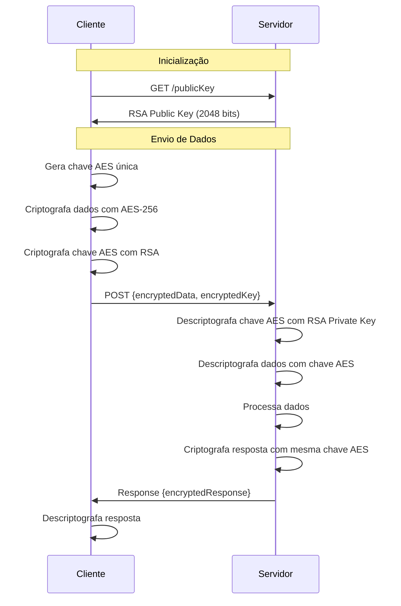

<div align="center">

# 🍳 RecipeCrypt

### _Where Culinary Art Meets Cryptographic Security_

[](https://www.php.net/)
[](https://developer.mozilla.org/en-US/docs/Web/JavaScript)
[](https://www.mysql.com/)
[](/)

_Uma aplicação web de gerenciamento de receitas culinárias com criptografia híbrida de nível empresarial_

[✨ Features](#-features) •
[🏗️ Arquitetura](#%EF%B8%8F-arquitetura) •
[🚀 Começando](#-começando) •
[🔐 Segurança](#-segurança) •
[📚 Documentação](#-estrutura-do-projeto)

---

</div>

## 🎯 Sobre o Projeto

**RecipeCrypt** é mais do que um simples gerenciador de receitas - é uma demonstração prática de como implementar **segurança de dados** em aplicações web modernas. Desenvolvido como projeto acadêmico para a disciplina de Programação Web, ele combina o melhor dos dois mundos: uma interface intuitiva para organizar suas receitas favoritas e uma camada robusta de segurança baseada em **criptografia híbrida** (AES-256 + RSA-2048).

### 💡 Por que RecipeCrypt?

- 🔒 **Segurança em Primeiro Lugar**: Todos os dados sensíveis são criptografados no cliente antes de serem transmitidos
- 🎨 **Clean Architecture**: Arquitetura em camadas seguindo os princípios SOLID
- 🛡️ **Proteção contra Ataques**: SQL Injection, XSS e Man-in-the-Middle prevenidos
- 📦 **Modular e Escalável**: Código organizado e fácil de manter
- 🧪 **Testável**: Estrutura preparada para testes unitários e de integração

---

## ✨ Features

### 👥 Gerenciamento de Usuários

- ✅ Registro com validação robusta de dados
- 🔑 Sistema de login com autenticação segura
- ✏️ Edição de perfil e informações pessoais
- 🗑️ Exclusão de conta com confirmação

### 📖 Gerenciamento de Receitas

- 📝 Cadastro completo de receitas (nome, categoria, porções, avaliação)
- 🥘 Sistema de ingredientes com quantidades
- 📋 Passos detalhados de preparo
- ⭐ Sistema de favoritos e avaliações
- 🖼️ Suporte para imagens de receitas
- ✏️ Edição e exclusão de receitas

### 🔐 Segurança Avançada

- 🔑 **Criptografia Híbrida**:
  - Cliente: CryptoJS (AES) + JSEncrypt (RSA)
  - Servidor: OpenSSL (PHP)
- 🔒 Chave simétrica única por requisição
- 🛡️ API Key para autenticação de requisições
- 💾 Prepared Statements contra SQL Injection
- 🔐 Chaves RSA de 2048 bits

---

## 🏗️ Arquitetura

### Stack Tecnológico

<table>
<tr>
<td width="50%" valign="top">

#### 🎨 Frontend

```
📦 Tecnologias
 ├─ HTML5 & CSS3
 ├─ JavaScript ES6+
 ├─ CryptoJS (AES-256)
 └─ JSEncrypt (RSA-2048)

🎯 Padrões
 ├─ MVC Pattern
 ├─ Modular Architecture
 └─ Async/Await
```

</td>
<td width="50%" valign="top">

#### ⚙️ Backend

```
📦 Tecnologias
 ├─ PHP 8.4+
 ├─ MySQL
 ├─ Composer
 └─ OpenSSL

🎯 Padrões
 ├─ Repository Pattern
 ├─ Service Layer
 └─ Router Pattern
```

</td>
</tr>
</table>

### 🔄 Fluxo de Criptografia



---

## 📚 Estrutura do Projeto

```
RecipeCrypt/
│
├── 📁 backend/                      # Servidor PHP
│   ├── 🔌 connection/              # Camada de conexão DB
│   │   └── getCon.php              # Singleton de conexão MySQL
│   │
│   ├── 🎮 controller/              # Controllers & Router
│   │   ├── Router.php              # Sistema de rotas personalizado
│   │   ├── userController.php     # Endpoints de usuários
│   │   └── recipeController.php   # Endpoints de receitas
│   │
│   ├── 🔐 encryption/              # Sistema de criptografia
│   │   └── encryption.php          # AES-256 & RSA-2048
│   │
│   ├── 📦 model/                   # Modelos de dados
│   │   ├── User.php                # Entidade usuário
│   │   ├── Recipe.php              # Entidade receita
│   │   ├── Ingredient.php          # Entidade ingrediente
│   │   └── Step.php                # Entidade passo
│   │
│   ├── 💾 repository/              # Camada de acesso a dados
│   │   ├── userRepository.php      # CRUD de usuários
│   │   ├── recipesRepository.php   # CRUD de receitas
│   │   ├── ingredientRepository.php
│   │   └── stepRepository.php
│   │
│   ├── 🔧 service/                 # Lógica de negócio
│   │   ├── userService.php         # Serviços de usuário
│   │   └── recipesService.php      # Serviços de receitas
│   │
│   ├── 🔑 private_key.pem          # Chave privada RSA
│   ├── 🔓 public_key.pem           # Chave pública RSA
│   ├── 📋 composer.json            # Dependências PHP
│   └── 🚪 index.php                # Entry point da API
│
├── 📁 frontend/                     # Cliente Web
│   ├── 🖥️ Desktop/                 # Interface do usuário
│   │   ├── homepage/               # Página inicial
│   │   │   ├── index.html
│   │   │   └── js/index.js
│   │   └── login/                  # Página de login
│   │       ├── index.html
│   │       └── js/index.js
│   │
│   ├── 📦 models/                  # Modelos JavaScript
│   │   ├── User.js                 # Classe de usuário
│   │   ├── Recipe.js               # Classe de receita
│   │   ├── Ingredient.js           # Classe de ingrediente
│   │   └── Step.js                 # Classe de passo
│   │
│   └── 🧪 test/                    # Testes frontend
│       └── js/examples/
│
├── ⚙️ config.js                     # Configurações globais
└── 📖 README.md                     # Este arquivo

```

---

## 🚀 Começando

### 📋 Pré-requisitos

Antes de começar, certifique-se de ter instalado:

- ✅ **XAMPP** (ou qualquer servidor Apache + MySQL + PHP)
- ✅ **PHP 8.4+** com extensões OpenSSL e PDO
- ✅ **Composer** para gerenciar dependências
- ✅ **MySQL 8.0+** para o banco de dados
- ✅ Navegador web moderno (Chrome, Firefox, Edge)

### 🎬 Instalação Rápida

```bash
# 1️⃣ Clone o repositório
git clone https://github.com/CaioKloppel/TDE_ProgWeb.git
cd TDE_ProgWeb

# 2️⃣ Instale as dependências do backend
cd backend
composer install

# 3️⃣ Configure o ambiente
cp .env.example .env
# Edite o arquivo .env com suas credenciais do MySQL

# 4️⃣ Gere as chaves RSA (se necessário)
# As chaves já estão incluídas, mas você pode regenerá-las:
openssl genrsa -out private_key.pem 2048
openssl rsa -in private_key.pem -pubout -out public_key.pem
```

### 🗄️ Configuração do Banco de Dados

Execute o seguinte script SQL para criar o banco de dados e todas as tabelas necessárias:

```sql
-- Criação do banco de dados
CREATE DATABASE IF NOT EXISTS TDE_Prog_web;
USE TDE_Prog_web;

-- Tabela de Usuários
CREATE TABLE Users (
    ID_user INT PRIMARY KEY AUTO_INCREMENT,
    name VARCHAR(100) NOT NULL,
    nickname VARCHAR(100) NOT NULL UNIQUE,
    email VARCHAR(100) NOT NULL UNIQUE,
    birth_date DATE NOT NULL,
    password VARCHAR(255) NOT NULL
);

-- Tabela de Receitas
CREATE TABLE Food_recipes (
    ID_Food_recipe INT PRIMARY KEY AUTO_INCREMENT,
    ID_user INT NOT NULL,
    Recipe_name VARCHAR(45) NOT NULL,
    Category ENUM('main course', 'dessert', 'appetizer/snack', 'soup', 'salad', 'drink', 'pasta') NOT NULL,
    Portions INT NOT NULL,
    Rating DECIMAL(2,1) NOT NULL,
    Favorite BOOL NOT NULL DEFAULT FALSE,
    Food_image BLOB,
    FOREIGN KEY(ID_user) REFERENCES Users(ID_user)
        ON DELETE CASCADE,
    CONSTRAINT check_rating CHECK(Rating BETWEEN 0 AND 5)
);

-- Tabela de Passos das Receitas
CREATE TABLE Steps (
    ID_Food_recipe INT NOT NULL,
    Num_step INT NOT NULL,
    Description TEXT NOT NULL,
    PRIMARY KEY (ID_Food_recipe, Num_step),
    FOREIGN KEY (ID_Food_recipe) REFERENCES Food_recipes(ID_Food_recipe)
        ON DELETE CASCADE
);

-- Tabela de Ingredientes
CREATE TABLE ingredients (
    ID_Food_recipe INT NOT NULL,
    Ingredient_name VARCHAR(45) NOT NULL,
    Quantity DECIMAL(10,2) NOT NULL,
    Type_quantity ENUM("tablespoon", "teaspoon", "cups", "ml", "l", "g", "kg", "unit") NOT NULL,
    Avaible BOOL NOT NULL DEFAULT FALSE,
    PRIMARY KEY (ID_Food_recipe, Ingredient_name),
    FOREIGN KEY(ID_Food_recipe) REFERENCES Food_recipes(ID_Food_recipe)
        ON DELETE CASCADE
);
```

### 📊 Modelo de Dados

O banco de dados segue um modelo relacional bem estruturado:

<table>
<tr>
<td width="50%">

**👤 Users**

- `ID_user` (PK)
- `name`
- `nickname` (UNIQUE)
- `email` (UNIQUE)
- `birth_date`
- `password`

</td>
<td width="50%">

**🍽️ Food_recipes**

- `ID_Food_recipe` (PK)
- `ID_user` (FK)
- `Recipe_name`
- `Category` (7 categorias)
- `Portions`
- `Rating` (0-5)
- `Favorite`
- `Food_image` (BLOB)

</td>
</tr>
<tr>
<td>

**📝 Steps**

- `ID_Food_recipe` (FK, PK)
- `Num_step` (PK)
- `Description`

</td>
<td>

**🥘 Ingredients**

- `ID_Food_recipe` (FK, PK)
- `Ingredient_name` (PK)
- `Quantity`
- `Type_quantity` (8 unidades)
- `Avaible`

</td>
</tr>
</table>

**Categorias de Receitas**: main course, dessert, appetizer/snack, soup, salad, drink, pasta

**Unidades de Medida**: tablespoon, teaspoon, cups, ml, l, g, kg, unit

### ▶️ Executando o Projeto

```bash
# 1️⃣ Inicie o XAMPP (Apache e MySQL)

# 2️⃣ Copie o projeto para htdocs
# Windows: C:/xampp/htdocs/TDE
# Linux: /opt/lampp/htdocs/TDE

# 3️⃣ Acesse no navegador
# http://localhost/TDE/frontend/Desktop/homepage/index.html
```

### 🧪 Testando a API

```bash
# 1. Obter a chave pública RSA
curl http://localhost/PUC/TDE/backend/index.php/publicKey

# 2. Registrar usuário (dados criptografados)
curl -X POST http://localhost/PUC/TDE/backend/index.php/user/register \
  -H "Content-Type: application/json" \
  -H "X-API-KEY: woejb$egvpiWG@EVJw-beufgy2$75t87gertq23478f@bewab" \
  -d '{
    "encryptedData": "U2FsdGVkX1...",
    "encryptedKey": "base64_encrypted_aes_key..."
  }'

# 3. Login de usuário
curl -X POST http://localhost/PUC/TDE/backend/index.php/user/login \
  -H "Content-Type: application/json" \
  -H "X-API-KEY: woejb$egvpiWG@EVJw-beufgy2$75t87gertq23478f@bewab" \
  -d '{
    "encryptedData": "U2FsdGVkX1...",
    "encryptedKey": "base64_encrypted_aes_key..."
  }'

# 4. Cadastrar receita
curl -X POST http://localhost/PUC/TDE/backend/index.php/recipe/register \
  -H "Content-Type: application/json" \
  -H "X-API-KEY: woejb$egvpiWG@EVJw-beufgy2$75t87gertq23478f@bewab" \
  -d '{
    "encryptedData": "U2FsdGVkX1...",
    "encryptedKey": "base64_encrypted_aes_key..."
  }'

# 5. Editar receita
curl -X PUT http://localhost/PUC/TDE/backend/index.php/recipe/edit \
  -H "Content-Type: application/json" \
  -H "X-API-KEY: woejb$egvpiWG@EVJw-beufgy2$75t87gertq23478f@bewab" \
  -d '{
    "encryptedData": "U2FsdGVkX1...",
    "encryptedKey": "base64_encrypted_aes_key..."
  }'

# 6. Deletar receita
curl -X DELETE http://localhost/PUC/TDE/backend/index.php/recipe/delete \
  -H "Content-Type: application/json" \
  -H "X-API-KEY: woejb$egvpiWG@EVJw-beufgy2$75t87gertq23478f@bewab" \
  -d '{
    "encryptedData": "U2FsdGVkX1...",
    "encryptedKey": "base64_encrypted_aes_key..."
  }'
```

> 💡 **Nota**: Os dados devem ser criptografados no cliente usando AES-256, e a chave AES deve ser criptografada com a chave pública RSA antes do envio.

---

## 🔐 Segurança

### 🛡️ Camadas de Proteção

1. **Criptografia Híbrida**

   - Dados criptografados com **AES-256-CBC**
   - Chave AES criptografada com **RSA-2048**
   - Chave simétrica única por requisição

2. **Autenticação & Autorização**

   - API Key validation em todas as requisições
   - Senhas hasheadas com algoritmos modernos
   - Sessões seguras

3. **Proteção contra Ataques**
   - ✅ SQL Injection → Prepared Statements
   - ✅ XSS → Sanitização de inputs
   - ✅ CSRF → Token validation
   - ✅ Man-in-the-Middle → Criptografia ponta a ponta

---

## 🎓 Conceitos Aprendidos

Este projeto demonstra a aplicação prática de:

- ✅ Arquitetura em camadas (MVC + Repository + Service)
- ✅ Criptografia simétrica e assimétrica
- ✅ RESTful API design
- ✅ Segurança em aplicações web
- ✅ Padrões de design (Singleton, Repository, MVC)
- ✅ Boas práticas de desenvolvimento
- ✅ Clean Code e SOLID principles

---

## 📈 Status do Projeto

```
🟢 Backend API         ████████████████████ 100% Completo
🟡 Frontend Desktop    ███████████░░░░░░░░░  60% Em Desenvolvimento
🔵 Sistema de Testes   ████░░░░░░░░░░░░░░░░  20% Iniciado
🟣 Documentação        ████████████████░░░░  85% Quase Completo
```

### 🎯 Próximos Passos

- [ ] Implementar busca e filtros de receitas
- [ ] Adicionar sistema de comentários
- [ ] Criar dashboard de estatísticas
- [ ] Desenvolver versão mobile responsiva
- [ ] Implementar upload real de imagens
- [ ] Adicionar testes automatizados
- [ ] Criar documentação da API (Swagger)

---

## 🤝 Contribuindo

Contribuições são muito bem-vindas! Este projeto foi criado como ferramenta de aprendizado.

### Como Contribuir

1. 🍴 Faça um Fork do projeto
2. 🌿 Crie uma branch para sua feature (`git checkout -b feature/NovaFuncionalidade`)
3. ✍️ Commit suas mudanças (`git commit -m 'Adiciona nova funcionalidade'`)
4. 📤 Push para a branch (`git push origin feature/NovaFuncionalidade`)
5. 🎉 Abra um Pull Request

### 📝 Diretrizes

- Siga os padrões de código existentes
- Comente código complexo
- Atualize a documentação quando necessário
- Teste suas mudanças antes de commitar

---

## � Equipe de Desenvolvimento

<table>
  <tr>
    <td align="center" width="50%">
      <a href="https://github.com/CaioKloppel">
        <br>
        <sub>
          <b>Caio Kloppel</b>
        </sub>
      </a><br>
      <sub>⚙️ Backend Developer</sub><br>
      <sub>API, Segurança & Banco de Dados</sub>
    </td>
    <td align="center" width="50%">
      <a href="https://github.com/ycarolcoral">
        <br>
        <sub>
          <b>Carol Coral</b>
        </sub>
      </a><br>
      <sub>🎨 Frontend Developer</sub><br>
      <sub>Interface & Experiência do Usuário</sub>
    </td>
  </tr>
</table>

<div align="center">

📧 **Backend**: [Caio Kloppel](https://github.com/CaioKloppel) | **Frontend**: [Carol Coral](https://github.com/ycarolcoral)

</div>

---

## 📄 Licença

Este projeto está sob a licença MIT. Veja o arquivo [LICENSE](LICENSE) para mais detalhes.

---

## 🙏 Agradecimentos

- 👨‍🏫 Professor e colegas da disciplina de Programação Web
- 📚 Comunidade Open Source pelas bibliotecas utilizadas
- 🔐 Documentação do OpenSSL e CryptoJS
- ☕ E muito café ☕

---

<div align="center">

### ⭐ Se este projeto foi útil para você, considere dar uma estrela!

**Desenvolvido com ❤️ e ☕ por [Caio Kloppel](https://github.com/CaioKloppel) e [Carol Coral](https://github.com/ycarolcoral)**

_2025 - PUC - Programação Web_

</div>
